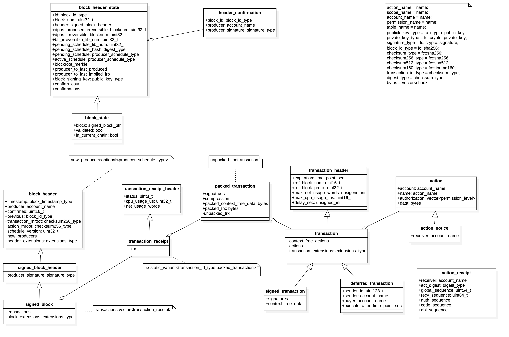

# Table of Content

* [总览](##总览)
* [环境](##环境)
* [预备知识](##预备知识)
* [chain分析](##chain分析)
  * [基本数据结构](###blockchain基本数据结构)
  * [producer_plugin](###producer_plugin)
  * [controller](###controller)
* [chainbase分析](##chainbase分析)
  * [基本数据结构](###database基本数据结构)
* [智能合约的持久化存储和database的交互](##智能合约的持久化存储和database交互)

## 总览
  
  本文主要致力于EOS区块结构、生产、打包、验证、存储等流程分析，当然其他部分源码也有涉及，但在此不做详细讨论。

## 环境
  
  Mac OS High Sierra 10.13.6  
  EOS源码版本1.2.1  
  CLion  
  CMake

## 预备知识

- 文档  
  
  [C++11新特性学习](C++新特性学习.md)

## chain分析

### blockchain基本数据结构

- 区块结构:  
  
  1. block_header,定义在：libraries/chain/include/eosio/chain/block_header.hpp第7行

  ``` cpp
  struct block_header {
    block_timestamp_type             timestamp;            //区块产生时间
    account_name                     producer;             //区块生产者
    uint16_t                         confirmed = 1;        //dpos确认数
    block_id_type                    previous;             //前一个区块的头的hash值
    checksum256_type                 transaction_mroot;    //区块包含的transactions的merkel树根
    checksum256_type                 action_mroot;         //区块包含的actions的merkel树根，这些actions实际包含在transactions中
    uint32_t                         schedule_version = 0;
    optional<producer_schedule_type> new_producers;
    extension_type                   header_extension;
  }
  ```
  
  2. signed_block_header,定义在：libraries/chain/include/eosio/chain/block_header.hpp第45行

  ``` cpp
  struct signed_block_header : public block_header {
	  signature_type producer_signature; //生产者的签名
  }
  ```

  3. signed_block,定义在：libraries/chain/include/eosio/chain/block.hpp 57行

  ``` cpp
  struct signed_block : public signed_block_header {
	  vector<transacton_receipt> transactions; //区块包含的transactions执行后得到的回执
	  extrension_type            block_extensions;
  }
  ```

  4. transaction_receipt_header,定义在：libraries/chain/include/eosio/chain/block.hpp 12行

  ``` cpp
  struct transaction_receipt_header {
	  enum status_enum {
		  executed   = 0,   //transaction成功执行，没有错误发生
		  soft_fail  = 1,   //
		  hard_fail  = 2,
		  delayed    = 3,
		  expired    = 4
	  };

	  fc::enum_type<uint8_t,status_enum> status;
	  uint32_t                           cpu_usage_us;   //总CPU使用时间，单位为微秒
	  fc::unsigned_int                   net_usage_words;//总网络使用量
  }
  ```

  5. transaction_receipt,定义在：libraries/chain/include/eosio/chain/block.hpp 33行

  ``` cpp
  struct transaction_receipt : public transaction_receipt_header {
    fc::static_variant<transaction_id_type,packed_transaction> trx; //已经执行过的transactions
  }
  ```

  6. transaction_header,定义在：libraries/chain/include/eosio/chain/transaction.hpp 30行

  ``` cpp
  struct transaction_header {
    time_point_sec               expiration;               //过期时间
    uint16_t                     ref_block_num = 0U;       //用于TaPos验证
    uint32_t                     ref_block_prefix = 0UL;   //用于TaPos验证
    fc::unsigned_int             max_net_usage_words = 0UL;
    uint8_t                      max_cpu_usage_ms = 0;
    fc::unsigned_int             delay_sec;
  }
  ```

  7. transaction,定义在：libraries/chain/include/eosio/chain/transaction.hpp 54行

  ``` cpp
  struct transaction : public transaction_header {
    vector<action>                 context_free_actions; //上下文无关的actions
    vector<action>                 actions;
    extension_type                 transaction_extensions;
  }
  ```

  8. signed_transaction,定义在：libraries/chain/include/eosio/chain/transaction.hpp 78行

  ``` cpp
  struct signed_transaction : public transaction {
    vector<signature>         signatures;
    vector<bytes>             context_free_data; //和context_free_action一一对应
  }
  ```

  9. packed_transaction,定义在：libraries/chain/include/eosio/chain/transaction.hpp 98行

  ``` cpp
  struct packed_transaction {
    enum compression_type {
      none  = 0,
      zlib  = 1
    }

    vector<signature_type>                  signatures;
    fc::enum_type<uint8_t,compression_type> compression;
    bytes                                   packed_context_free_data;
    bytes                                   packed_trx;
  }
  ```

  10. deferred_transaction,定义在：libraries/chain/include/eosio/chain/transaction.hpp 157行
  
  ``` cpp
  struct deferred_transaction : public signed_transaction {
    uint128_t                  sender_id;
    account_name               sender;
    account_name               payer;
    time_point_sec             execute_after;
  }
  ```

  11. action，定义在：libraries/chain/include/eosio/chain/action.hpp 60行
   
   ``` cpp
   struct action {
       account_name             account;
       action_name              name;
       vector<permission_level> authorization;
       bytes                    data;
   }
   ```

  12. pending_state,定义在：libraries/chain/controller.cpp 91行,这是区块生产过程和区块同步过程中一个非常关键的数据结构
   
   ``` cpp
   struct pending_state {
       maybe_session            _db_session; //数据库session，主要涉及undo,squash,push相关操作，使数据库undo_state处于正确状态
       block_state_ptr          _pending_block_state;
       vector<action_receipt>   _actions;   //transactions在执行过程中生成的action_receipt，会打包到区块中(finalize_block)
       controller::block_status _block_status;
   }
   ```

  13. block_header_state,定义在：libraries/chain/include/eosio/chain/block_header_state.hpp 11行
   这个结构定义了验证transaction所需的头部信息，以及生成一个新的block所需的信息
   ``` cpp
   struct block_header_state {
       block_id_type             id;//最近的block_id
       uint32_t                  block_num = 0;//最近的block的高度/值
       signed_block_header       header;       //最近的block header;
       uint32_t                  dpos_proposed_irreversible_blocknum = 0;//最新的被提出dpos不可逆的区块高度/值，需要dpos计算确认
       uint32_t                  dpos_irreversible_blocknum = 0;//最新的dpos不可逆区块高度/值，这个是已经确认了的
       uint32_t                  bft_irreversible_block = 0;    //bft不可逆区块高度/值
       uint32_t                  pending_schedule_lib_num;      //
       digest_type               pending_schedule_hash;
       producer_schedule_type    pending_schedule;
       producer_schedule_type    active_schedule;
       incremental_merkel        block_root_merkle;
       flat_map<account_name,uint32_t> producer_to_last_produced;
       flat_map<account_name,uint32_t> procuer_to_last_implied_irb;
       public_key_type                 block_signing_key;        //当前生产者的签名
       vector<uint8_t>                 confirm_count;
       vector<header_confirmation>     confirmations;
   }
   ```

  14. block_state,定义在：libraries/chain/include/eosio/chain/block_state.hpp 14行
   ``` cpp
   struct block_state : public block_header_state {
       signed_block_ptr              block;            //前一个block指针
       bool                          validated = false;
       bool                          in_current_chain = false;
   }
   ```
  15. 

以上为EOS区块的关键数据结构，下面的分析都是围绕着以上的数据结构来进行的。数据结构之间的关系如下：  

### producer_plugin

  producer_plugin实现了区块生产和区块同步的调用功能。  
  头文件定义在：plugins/producer_plugin/include/eosio/producer_plugin/producer_plugin.hpp  
  实现文件定义在：plugins/producer_plugin/producer_plugin.cpp  
  
  开始插件系统会调用producer_plugin::set_program_options函数进行相关程序项的设置：
  1. 生成config.ini文件(如果该文件不存在的话)
  2. 读取配置  
  调用producer_plugin::plugin_initialize函数进行初始化工作：  
  1. 初始化配置
  2. 设置信号函数

  调用producer_plugin::plugin_start函数，主要完成的功能如下：
  1. 设置信号函数：  
   ``` cpp
    my->_accepted_block_connection.emplace(chain.accepted_block.connect( [this]( const auto& bsp ){ my->on_block( bsp ); } ));
    my->_irreversible_block_connection.emplace(chain.irreversible_block.connect( [this]( const auto& bsp ){ my->on_irreversible_block( bsp->block ); } ));
   ```
  2. 获取最新的不可逆的区块号
  3. 进入生产区块的调度 producer_plugin_impl::schedule_production_loop

  producer_plugin_impl::schedule_production_loop:  
  1. 取消前一次的_timer操作：  
   ``` cpp
   chain::controller& chain = app().get_plugin<chain_plugin>().chain();
   _timer.cancel();
   std::weak_ptr<producer_plugin_impl> weak_this = shared_from_this();
   ```
  2. 调用 result = start_block(bool &last_block),函数定义在plugins/producer_plugin/producer_plugin.cpp 882行:  
   在该函数中：  
   * 首先会取得chain::controller的引用chain，判断chain当前的数据库模式是否为db_read_mode::READ_ONLY,如果是则返回状态start_block_result::waiting;如果不是则将当前的_pending_block_mode设为pending_block_mode::producing：  
   ``` cpp
   chain::controller& chain = app().get_plugin<chain_plugin>().chain();

   if( chain.get_read_mode() == chain::db_read_mode::READ_ONLY )
      return start_block_result::waiting;
   ```  
   * 计算当前节点是否为生产节点，获取当前被调度的生产者的watermark和signature:  
   ``` cpp
   last_block = ((block_timestamp_type(block_time).slot % config::producer_repetitions) == config::producer_repetitions - 1);
   const auto& scheduled_producer = hbs->get_scheduled_producer(block_time);
   auto currrent_watermark_itr = _producer_watermarks.find(scheduled_producer.producer_name);
   auto signature_provider_itr = _signature_providers.find(scheduled_producer.block_signing_key);
   auto irreversible_block_age = get_irreversible_block_age();
   ```
   * 进行一系列的条件判断:  
     检查当前节点是否被允许生产、被调度的生产者是否在生产队列中等：
   ``` cpp
   if( !_production_enabled ) {
      _pending_block_mode = pending_block_mode::speculating;
   } else if( _producers.find(scheduled_producer.producer_name) == _producers.end()) {
      _pending_block_mode = pending_block_mode::speculating;
   } else if (signature_provider_itr == _signature_providers.end()) {
      elog("Not producing block because I don't have the private key for ${scheduled_key}", ("scheduled_key", scheduled_producer.block_signing_key));
      _pending_block_mode = pending_block_mode::speculating;
   } else if ( _pause_production ) {
      elog("Not producing block because production is explicitly paused");
      _pending_block_mode = pending_block_mode::speculating;
   } else if ( _max_irreversible_block_age_us.count() >= 0 && irreversible_block_age >= _max_irreversible_block_age_us ) {
      elog("Not producing block because the irreversible block is too old [age:${age}s, max:${max}s]", ("age", irreversible_block_age.count() / 1'000'000)( "max", _max_irreversible_block_age_us.count() / 1'000'000 ));
      _pending_block_mode = pending_block_mode::speculating;
   }
   ```
   * 调用controller::abort_block
   * 调用controller::start_block 这两个函数在后文详述。
   * 在调用controller::start_block之后，在controller_impl中就会生成一个全新的pending包含了最新生成的区块头部信息  
     然后需要对新块进行transaction打包：  
     * 清理过期的transaction:  
       ```cpp
       // remove all persisted transactions that have now expired
      auto& persisted_by_id = _persistent_transactions.get<by_id>();
      auto& persisted_by_expiry = _persistent_transactions.get<by_expiry>();
      while(!persisted_by_expiry.empty() && persisted_by_expiry.begin()->expiry <= pbs->header.timestamp.to_time_point()) {
         persisted_by_expiry.erase(persisted_by_expiry.begin());
      }
       ```
     * 
  3. 判断start_block返回值：  
   * result == failed  
     start pending block 失败，稍后再试.启动定时器_timer，等待50ms再次进入schedule_production_loop
     ```cpp
      if (result == start_block_result::failed) {
      elog("Failed to start a pending block, will try again later");
      _timer.expires_from_now( boost::posix_time::microseconds( config::block_interval_us  / 10 ));

      // we failed to start a block, so try again later?
      //启动定时器，待会儿再试
      _timer.async_wait([weak_this,cid=++_timer_corelation_id](const boost::system::error_code& ec) {
         auto self = weak_this.lock();
         if (self && ec != boost::asio::error::operation_aborted && cid == self->_timer_corelation_id) {
            self->schedule_production_loop();
         }
      });
     }
     ```
   * result == waiting
    调用producer_plugin_impl::schedule_delayed_production
     ```cpp
     if (result == start_block_result::waiting){

         //这里检查生产者队列是否为空和是否被允许生产
      if (!_producers.empty() && !production_disabled_by_policy()) {
         fc_dlog(_log, "Waiting till another block is received and scheduling Speculative/Production Change");
         schedule_delayed_production_loop(weak_this, calculate_pending_block_time());
      } else {
         fc_dlog(_log, "Waiting till another block is received");
         // nothing to do until more blocks arrive
      }

     }
     ```
   * _pending_block_mode == producint && result == successed  
     启动定时器,在若干毫秒之后调用producer_plugin_impl::maybe_produce_block进行区块生产的完成工作，在这个时间段内当前节点收到的所有transaction都会被打进这个区块中。
   ```cpp
   if (_pending_block_mode == pending_block_mode::producing) {

      // we succeeded but block may be exhausted
      static const boost::posix_time::ptime epoch(boost::gregorian::date(1970, 1, 1));
      if (result == start_block_result::succeeded) {
         // ship this block off no later than its deadline
         _timer.expires_at(epoch + boost::posix_time::microseconds(chain.pending_block_time().time_since_epoch().count() + (last_block ? _last_block_time_offset_us : _produce_time_offset_us)));
         fc_dlog(_log, "Scheduling Block Production on Normal Block #${num} for ${time}", ("num", chain.pending_block_state()->block_num)("time",chain.pending_block_time()));
      } else {
         auto expect_time = chain.pending_block_time() - fc::microseconds(config::block_interval_us);
         // ship this block off up to 1 block time earlier or immediately
         if (fc::time_point::now() >= expect_time) {
            _timer.expires_from_now( boost::posix_time::microseconds( 0 ));
         } else {
            _timer.expires_at(epoch + boost::posix_time::microseconds(expect_time.time_since_epoch().count()));
         }
         fc_dlog(_log, "Scheduling Block Production on Exhausted Block #${num} immediately", ("num", chain.pending_block_state()->block_num));
      }

      _timer.async_wait([&chain,weak_this,cid=++_timer_corelation_id](const boost::system::error_code& ec) {
         auto self = weak_this.lock();
         if (self && ec != boost::asio::error::operation_aborted && cid == self->_timer_corelation_id) {
            auto res = self->maybe_produce_block();
            fc_dlog(_log, "Producing Block #${num} returned: ${res}", ("num", chain.pending_block_state()->block_num)("res", res) );
         }
      });
   }
   ```
  4. producer_plugin_impl::maybe_produce_block,这个函数会调用producer_plugin_impl::produce_block完成区块生产：
   ```cpp
   //确保在异常退出候，scheudle_production_loop依然能够正常进行下去
   auto reschedule = fc::make_scoped_exit([this]{
      schedule_production_loop();
   });

   try {
       //完成区块的finalize_block,区块签名，更新fork_db
      produce_block();
      return true;
   } catch ( const guard_exception& e ) {
      app().get_plugin<chain_plugin>().handle_guard_exception(e);
      return false;
   } catch ( boost::interprocess::bad_alloc& ) {
      raise(SIGUSR1);
      return false;
   } FC_LOG_AND_DROP();

   fc_dlog(_log, "Aborting block due to produce_block error");
   chain::controller& chain = app().get_plugin<chain_plugin>().chain();
   chain.abort_block();
   return false;
   ```

  5. producer_plugin_impl::produce_block函数主要完成区块生产的主要工作包括：  
  * finalize_block:  
    更新资源限制  
    设置action merkle树根  
    设置transaction merkle树根
    ...在controller中有更详细说明
  * sign_block
   对block进行签名，防止被篡改
  * commit_block
   将新产生的区块加到数据库中，并将该区块广播出去。在controller有详细叙述

   ```cpp
   EOS_ASSERT(_pending_block_mode == pending_block_mode::producing, producer_exception, "called produce_block while not actually producing");
   chain::controller& chain = app().get_plugin<chain_plugin>().chain();
   const auto& pbs = chain.pending_block_state();
   const auto& hbs = chain.head_block_state();
   EOS_ASSERT(pbs, missing_pending_block_state, "pending_block_state does not exist but it should, another plugin may have corrupted it");
   auto signature_provider_itr = _signature_providers.find( pbs->block_signing_key );

   EOS_ASSERT(signature_provider_itr != _signature_providers.end(), producer_priv_key_not_found, "Attempting to produce a block for which we don't have the private key");

   //idump( (fc::time_point::now() - chain.pending_block_time()) );
   //完成块
   chain.finalize_block();
   //对块进行签名
   chain.sign_block( [&]( const digest_type& d ) {
      auto debug_logger = maybe_make_debug_time_logger();
      return signature_provider_itr->second(d);
   } );
   //提交块到数据库
   chain.commit_block();
   auto hbt = chain.head_block_time();
   //idump((fc::time_point::now() - hbt));

   block_state_ptr new_bs = chain.head_block_state();
   _producer_watermarks[new_bs->header.producer] = chain.head_block_num();

   ilog("Produced block ${id}... #${n} @ ${t} signed by ${p} [trxs: ${count}, lib: ${lib}, confirmed: ${confs}]",
        ("p",new_bs->header.producer)("id",fc::variant(new_bs->id).as_string().substr(0,16))
        ("n",new_bs->block_num)("t",new_bs->header.timestamp)
        ("count",new_bs->block->transactions.size())("lib",chain.last_irreversible_block_num())("confs", new_bs->header.confirmed));
   ```

   至此producer_plugin中区块的生产流程已经介绍完毕，更详细的分析会在controller中体现出来。  总体时序如下：  

    

   区块同步流程：


### controller
producer_plugin在区块生产的过程中扮演着调度的角色，而实际工作是放在controller中来完成的，下面将纤细分析controller在区块生成过程中所扮演的角色功能：  
上文说到在producer_plugin_impl::start_block函数中会调用controller::abort_block和controller::start_block两个函数，这里需要展示一下controller相关数据结构,controller的功能主要是在controller_impl中实现的，这里只列举关键部分：
```cpp
struct controller {
    enum class block_status {
        irreversible = 0, //区块已经被应用,且不可逆
        validated = 1,    //区块已经被可信任的生产者签名，并已经应用但还不是不可逆状态
        complete = 2,     //区块已经被可信任的生产者签名，但是还没有被应用，状态为可逆
        incomplete = 3    //区块正在生产过程
    }；

    //信号量集合
    signal<void(const signed_block_ptr&)>         pre_accepted_block;
    signal<void(const block_state_ptr&)>          accepted_block_header;
    signal<void(const block_state_ptr&)>          accepted_block;
    signal<void(const block_state_ptr&)>          irreversible_block;
    signal<void(const transaction_metadata_ptr&)> accepted_transaction;
    signal<void(const transaction_trace_ptr&)>    applied_transaction;
    signal<void(const header_confirmation&)>      accepted_confirmation;
    signal<void(const int&)>                      bad_alloc;

    private:
        std::unique_ptr<controller_impl>   my;
};

struct controller_impl {
    controller&                  self;
    chainbase::database          db;   // state db,主要是存储合约执行后的各种状态信息
    chainbase::database          reversible_blocks; //用来存储已经成功应用但是还是可逆状态
    block_log                    blog;
    optional<pending_state>      pending;   //保存正在生成的block信息，该结构在上文已经列出
    block_state_ptr              head;      //上一次block state信息，该结构在上文已经列出
    fork_database                fork_db;
    wasm_interface               wasmif;
    resource_limits_manager      resource_limits;
    authorization_manager        authorization;
    ...
    /**
    *  Transactions that were undone by pop_block or abort_block, transactions
    *  are removed from this list if they are re-applied in other blocks. Producers
    *  can query this list when scheduling new transactions into blocks.
    */

    /**transaction的撤销由pop_block或abort_block来完成。如果有其他块重新应用了这些事物，则需要从该列表中将其删除。
    * 当新transaction被调度成块是，用户可以查询列表。
    * 从后面的分析中可以看到，abort_block并没有完成撤销工作
    */
    map<digest_type,transaction_metadata_ptr> unapplied_transactions;
    .
    .
    .
}

```
controller的初始化工作是由chain_plugin::plugin_initialize函数来完成的：检查白名单、黑名单、灰名单，数据库目录、检查点、及命令行参数的检查，主要功能定义在：plugins/chain_plugin/chain_plugin.cpp 314行。  
在chain_plugin中还负责相关channel的初始化工作。  
然后chain_plugin::plugin_start函数会将controller启动,定义在：plugins/chain_plugin/chain_plugin.cpp 633行：
```cpp
try {
   try {
       //controller启动
      my->chain->startup();
   } catch (const database_guard_exception& e) {
      log_guard_exception(e);
      // make sure to properly close the db
      my->chain.reset();
      throw;
   }

   if(!my->readonly) {
      ilog("starting chain in read/write mode");
   }

   ilog("Blockchain started; head block is #${num}, genesis timestamp is ${ts}",
        ("num", my->chain->head_block_num())("ts", (std::string)my->chain_config->genesis.initial_timestamp));

   my->chain_config.reset();
} FC_CAPTURE_AND_RETHROW()
```
在controller::startup中会调用controller_impl::add_index:  
这个函数主要为controller_impl::reversible_block和db添加索引：  
```cpp
      //为reversible block建立索引
      reversible_blocks.add_index<reversible_block_index>();

      db.add_index<account_index>();
      db.add_index<account_sequence_index>();

      db.add_index<table_id_multi_index>();
      db.add_index<key_value_index>();
      db.add_index<index64_index>();
      db.add_index<index128_index>();
      db.add_index<index256_index>();
      db.add_index<index_double_index>();
      db.add_index<index_long_double_index>();

      db.add_index<global_property_multi_index>();
      db.add_index<dynamic_global_property_multi_index>();
      db.add_index<block_summary_multi_index>();
      db.add_index<transaction_multi_index>();
      db.add_index<generated_transaction_multi_index>();

      authorization.add_indices();
      resource_limits.add_indices();
```
上述结构在后文有详细说明；然后进行fork_db的初始化工作，设置controller_impl::head,使其处于正确的状态为后续的区块生产做准备工作，到这里区块的初始化基本完成了，下面就到了区块生产的环节了。  

从上文我们知道producer_plugin::start_block最后会调用controller::abort_block和start_block两个函数,这两个函数最终会调用controller_impl::abort_block和controller_impl::start_block两个函数：  
controller_impl::abort_block重置controller_impl::pending信息，使pending处于全新状态:  
```cpp
if( pending ) {
    
    //这里只是将_pending_block_state中的transaction重新放到unapplied_transactions中，并没有做撤销工作
    if ( read_mode == db_read_mode::SPECULATIVE ) {
    for( const auto& t : pending->_pending_block_state->trxs )
        unapplied_transactions[t->signed_id] = t;
    }
    pending.reset();
}
```  
controller_impl::start_block函数接受三个参数：1.即将要产生的区块的时间戳when，2.区块确认数量confirm_block_count,3.区块当前的状态status:  
  * 判断controller_impl::pending是否为初始状态，否则抛出异常
    ```cpp
    EOS_ASSERT( !pending, block_validate_exception, "pending block already exists" );
    ```
  * 建立db session
    ```cpp
     if (!self.skip_db_sessions(s)) {
         EOS_ASSERT( db.revision() == head->block_num, database_exception, "db revision is not on par with head block",
                     ("db.revision()", db.revision())("controller_head_block", head->block_num)("fork_db_head_block", fork_db.head()->block_num) );

         pending.emplace(maybe_session(db));
      } else {
         pending.emplace(maybe_session());
      }
    ```
  * 根据最近的controller_impl::head生成新的pending
    ```cpp
    pending->_block_status = s;

    //这里会调用block_head::block_head(const block_header_state& prev, block_timestamp_type when)
    //然后调用block_state_head::generate_next根据传进来的时间戳when生成新的block_header_state(新块)
    //应为当前节点是正在出块的节点，所以在generate_next不需要对块进行完整性验证
    //在同步块的时候则需要调用next函数，并做完整性验证后面详述
    //generate_next代码定义在 libraries/chain/block_header_state.cpp 36行
    pending->_pending_block_state = std::make_shared<block_state>( *head, when ); // promotes pending schedule (if any) to active
    pending->_pending_block_state->in_current_chain = true;
    ```
  * 将出块action打进transaction并执行,然后清理过期的transactions更新生产者授权
    ```cpp
        try {
            auto onbtrx = std::make_shared<transaction_metadata>( get_on_block_transaction() );
            onbtrx->implicit = true;
            auto reset_in_trx_requiring_checks = fc::make_scoped_exit([old_value=in_trx_requiring_checks,this](){
                  in_trx_requiring_checks = old_value;
               });
            in_trx_requiring_checks = true;
            push_transaction( onbtrx, fc::time_point::maximum(), self.get_global_properties().configuration.min_transaction_cpu_usage, true );
         } catch( const boost::interprocess::bad_alloc& e  ) {
            elog( "on block transaction failed due to a bad allocation" );
            throw;
         } catch( const fc::exception& e ) {
            wlog( "on block transaction failed, but shouldn't impact block generation, system contract needs update" );
            edump((e.to_detail_string()));
         } catch( ... ) {
         }

         clear_expired_input_transactions();
         update_producers_authority();
    ```
  至此controller_impl::start_block函数分析完毕，其主要功能就是根据当前head生成新块，并将出块action打进transaction中。
  在controller_impl::start_block函数执行完毕候，控制权就交还给producer_plugin_impl::start_block了,在上文有对应的分析，producer_plugin_impl::start_block最终会把控制权交给producer_plugin_impl::schedule_production_loop，在这个函数中会启动一个定时器，在延迟一段时间之后会调用proudcer_plugin_impl::maybe_produce_block，这个函数会调用producer_plugin_impl::produce_block这在上文都有分析到，在producer_plugin_impl::produce_block中会调用:  
  controller::finalize_block,controller::sign_block和controller::commit_block三个函数来完成区块生产，区块签名，区块上链过程，下面来一次分析这三个函数：  
  * controller::finalize_block  
   这个函数主要是完成资源更新包括生产该区块所使用的cpu资源，带宽资源；设置action merkle树根；设置transaction merkle树根，创建block summary信息:
   ```cpp
   resource_limits.process_account_limit_updates();
    const auto& chain_config = self.get_global_properties().configuration;
    uint32_t max_virtual_mult = 1000;
    uint64_t CPU_TARGET = EOS_PERCENT(chain_config.max_block_cpu_usage, chain_config.target_block_cpu_usage_pct);
    resource_limits.set_block_parameters(
        { CPU_TARGET, chain_config.max_block_cpu_usage, config::block_cpu_usage_average_window_ms / config::block_interval_ms, max_virtual_mult, {99, 100}, {1000, 999}},
        {EOS_PERCENT(chain_config.max_block_net_usage, chain_config.target_block_net_usage_pct), chain_config.max_block_net_usage, config::block_size_average_window_ms / config::block_interval_ms, max_virtual_mult, {99, 100}, {1000, 999}}
    );
    resource_limits.process_block_usage(pending->_pending_block_state->block_num);

    //设置action merkle树根
    set_action_merkle();

    //设置transaction merkle树根
    set_trx_merkle();

    auto p = pending->_pending_block_state;
    p->id = p->header.id();

    //根据block id生成 summary信息并放到数据库中
    create_block_summary(p->id);
   ```
  * controller::sign_block  
   根据当前生产者提供的私钥签名函数对当前区块进行签名，并对做一次签名验证。
   ```cpp
    auto p = pending->_pending_block_state;
    p->sign( signer_callback );
    static_cast<signed_block_header&>(*p->block) = p->header;
   ```
   block_header_state::sign(上面p->sign)定义如下：
   ```cpp
    auto d = sig_digest();
    header.producer_signature = signer( d );
    EOS_ASSERT( block_signing_key == fc::crypto::public_key( header.producer_signature, d ), wrong_signing_key, "block is signed with unexpected key" );
   ```
  * controller::commit_block
   在详细分析这个函数之前需要先来分析一下fork_database这个类，它的结构如下：
   ```cpp
    struct by_block_id;
    struct by_block_num;
    struct by_lib_block_num;
    struct by_prev;

    //建立一个基于block_state_ptr的多索引容器
    //by_block_id以block id为索引
    //by_block_num 以区块高度为索引
    //by_lib_block_num以最近的区块不可逆高度为索引
    //by_prev以前一个block id为索引
    typedef multi_index_container<
        block_state_ptr,
        indexed_by<
          hashed_unique< tag<by_block_id>, member<block_header_state, block_id_type, &block_header_state::id>, std::hash<block_id_type>>,
          ordered_non_unique< tag<by_prev>, const_mem_fun<block_header_state, const block_id_type&, &block_header_state::prev> >,
          ordered_non_unique< tag<by_block_num>,
              composite_key< block_state,
                member<block_header_state,uint32_t,&block_header_state::block_num>,
                member<block_state,bool,&block_state::in_current_chain>
              >,
              composite_key_compare< std::less<uint32_t>, std::greater<bool> >
          >,
          ordered_non_unique< tag<by_lib_block_num>,
              composite_key< block_header_state,
                  member<block_header_state,uint32_t,&block_header_state::dpos_irreversible_blocknum>,
                  member<block_header_state,uint32_t,&block_header_state::bft_irreversible_blocknum>,
                  member<block_header_state,uint32_t,&block_header_state::block_num>
              >,
              composite_key_compare< std::greater<uint32_t>, std::greater<uint32_t>, std::greater<uint32_t> >
          >
        >
    > fork_multi_index_type;
    struct fork_database_impl {
      fork_multi_index_type    index;
      block_state_ptr          head; //区块头
      fc::path                 datadir; //存储路径
    }

    class fork_database {
    public:
      //这里列举关键函数,详细定义参见 libraries/chain/include/eosio/chain/fork_database.hpp

      //根据区块id获取block_state信息
      block_state_ptr get_block(const block_id_type &id) const;
      //根据区块高度从当前链中获取block_state信息
      block_state_ptr get_block_in_current_chain_by_num(uint32_t num) const;

      //提供一个“有效的”区块状态，有可能以此建立分支
      void set(block_state_ptr s);
      
      block_state_ptr add(signed_block_ptr b,bool trust = false);

      block_state_ptr add(block_state_ptr next_block);
      void remove(const block_id_type &id);
      void add(const header_confirmation &c);
      const block_state_ptr &head() const;

      //根据两个头block，获取两个分支（两个分支有共同的祖先，即两个头部的previous的值相同）
      pair<branch_type,branch_type> fetch_branch_from(const block_id_type &first,const block_id_type &second) const;

      //若该区块为invalid,将会从数据库中删除。若为valid，在发射irreversible信号后，所有比LIB大的block将会被修正
      void set_validity(const block_state_ptr &h,bool valid);
      void mark_in_current_chain(const block_state_ptr &h,bool in_current_chain);
      void prune(const block_state_ptr&);

      signal<void(block_state_ptr)>    irreversible;

    private:
      void set_bft_irreversible(block_id_type id);
      unique_ptr<for_database_impl> my;
    }

   ```
  回到controller_impl::commit_block,该接受一个bool参数，该参数表示是否需要将controller_impl::pending->_pending_block_state加入fork_database,如果是则将pending->_pending_block_state->validated设为true,然后调用fork_database::add(block_state_ptr)将该块加入数据库，然后会根据当前的block_state进行数据库数据修正(后文fork_database部分有详细分析),然后检查是否正在重演该区块，如果否则将其加入可以缓存reversible_blocks,发射accept_block信号,该信号会调用net_plugin_impl::accept_block，函数，这些信号量的设置定义在plugins/net_plugin/net_plugin.cpp 3017行：
  ```cpp
    chain::controller&cc = my->chain_plug->chain();
    {
        cc.accepted_block_header.connect( boost::bind(&net_plugin_impl::accepted_block_header, my.get(), _1));
        cc.accepted_block.connect(  boost::bind(&net_plugin_impl::accepted_block, my.get(), _1));
        cc.irreversible_block.connect( boost::bind(&net_plugin_impl::irreversible_block, my.get(), _1));
        cc.accepted_transaction.connect( boost::bind(&net_plugin_impl::accepted_transaction, my.get(), _1));
        cc.applied_transaction.connect( boost::bind(&net_plugin_impl::applied_transaction, my.get(), _1));
        cc.accepted_confirmation.connect( boost::bind(&net_plugin_impl::accepted_confirmation, my.get(), _1));
    }
  ```
  commit_block关键代码如下：
  ```cpp
    try {
        if (add_to_fork_db) {
          pending->_pending_block_state->validated = true;
          auto new_bsp = fork_db.add(pending->_pending_block_state);
          emit(self.accepted_block_header, pending->_pending_block_state);

          //更新head到最新生成的区块头
          head = fork_db.head();
          EOS_ASSERT(new_bsp == head, fork_database_exception, "committed block did not become the new head in fork database");
        }

        if( !replaying ) {
          reversible_blocks.create<reversible_block_object>( [&]( auto& ubo ) {
              ubo.blocknum = pending->_pending_block_state->block_num;
              ubo.set_block( pending->_pending_block_state->block );
          });
        }

        emit( self.accepted_block, pending->_pending_block_state );
    } catch (...) {
        // dont bother resetting pending, instead abort the block
        reset_pending_on_exit.cancel();
        abort_block();
        throw;
    }
  ```
  至此controller_impl::commit_block工作完成。控制权回到producer_plugin_impl::produce_block,一次block生产调度就完成了，然后进入下一次调度。

  fork_database分析：  
  结构如下：
  ```cpp

    struct by_block_id;
    struct by_block_num;
    struct by_lib_block_num;
    struct by_prev;

    //建立一个基于block_state_ptr的多索引容器
    //by_block_id以block id为索引
    //by_block_num 以区块高度为索引，组合键<block_num,in_current_chain>,降序
    //by_lib_block_num以最近的区块不可逆高度为索引，组合键<dpos_irreversible_blocknum,bft_irreversible_blocknum,block_num>，升序
    //by_prev以前一个block id为索引
    typedef multi_index_container<
        block_state_ptr,
        indexed_by<
          hashed_unique< tag<by_block_id>, member<block_header_state, block_id_type, &block_header_state::id>, std::hash<block_id_type>>,
          ordered_non_unique< tag<by_prev>, const_mem_fun<block_header_state, const block_id_type&, &block_header_state::prev> >,
          ordered_non_unique< tag<by_block_num>,
              composite_key< block_state,
                member<block_header_state,uint32_t,&block_header_state::block_num>,
                member<block_state,bool,&block_state::in_current_chain>
              >,
              composite_key_compare< std::less<uint32_t>, std::greater<bool> >
          >,
          ordered_non_unique< tag<by_lib_block_num>,
              composite_key< block_header_state,
                  member<block_header_state,uint32_t,&block_header_state::dpos_irreversible_blocknum>,
                  member<block_header_state,uint32_t,&block_header_state::bft_irreversible_blocknum>,
                  member<block_header_state,uint32_t,&block_header_state::block_num>
              >,
              composite_key_compare< std::greater<uint32_t>, std::greater<uint32_t>, std::greater<uint32_t> >
          >
        >
    > fork_multi_index_type;
    struct fork_database_impl {
      fork_multi_index_type    index;
      block_state_ptr          head; //区块头
      fc::path                 datadir; //存储路径
    }

    class fork_database {
    public:
      //这里列举关键函数,详细定义参见 libraries/chain/include/eosio/chain/fork_database.hpp

      //根据区块id获取block_state信息
      block_state_ptr get_block(const block_id_type &id) const;
      //根据区块高度从当前链中获取block_state信息
      block_state_ptr get_block_in_current_chain_by_num(uint32_t num) const;

      //提供一个“有效的”区块状态，有可能以此建立分支
      void set(block_state_ptr s);
      
      block_state_ptr add(signed_block_ptr b,bool trust = false);

      block_state_ptr add(block_state_ptr next_block);
      void remove(const block_id_type &id);
      void add(const header_confirmation &c);
      const block_state_ptr &head() const;

      //根据两个头block，获取两个分支（两个分支有共同的祖先，即两个头部的previous的值相同）
      pair<branch_type,branch_type> fetch_branch_from(const block_id_type &first,const block_id_type &second) const;

      //若该区块为invalid,将会从数据库中删除。若为valid，在发射irreversible信号后，所有比LIB大的block将会被修正
      void set_validity(const block_state_ptr &h,bool valid);
      void mark_in_current_chain(const block_state_ptr &h,bool in_current_chain);
      void prune(const block_state_ptr&);

      signal<void(block_state_ptr)>    irreversible;

    private:
      void set_bft_irreversible(block_id_type id);
      unique_ptr<for_database_impl> my;
    }

  ```
  下面一次解释每个函数的实现：  
  1. void fork_database::set(block_state_ptr s)
   ```cpp
    //将s插入多索引容器中
    auto result = my->index.insert( s );
      EOS_ASSERT( s->id == s->header.id(), fork_database_exception, 
                  "block state id (${id}) is different from block state header id (${hid})", ("id", string(s->id))("hid", string(s->header.id())) );

         //FC_ASSERT( s->block_num == s->header.block_num() );

      EOS_ASSERT( result.second, fork_database_exception, "unable to insert block state, duplicate state detected" );


      //更新head状态
      if( !my->head ) {
         my->head =  s;
      } else if( my->head->block_num < s->block_num ) {
         my->head =  s;
      }
   ```
  2. 
  3. 
  4. 


  transaction执行，涉及到的关键数据结构如下：
  ```cpp

    struct action_receipt {
      account_name        receiver;                //执行该action的account
      digest_type         act_digest;
      uint64_t            global_sequence = 0;
      uint64_t            recv_sequence = 0;
      flat_map<account_name,uint64_t> auth_sequence;
      fc::unsigned_int    code_sequence;
      fc::unsigned_int    abi_sequence;
    };

    struct base_action_trace {
      action_receipt      receipt;
      action              act;
      fc::microseconds    elapsed;
      uint64_t            cpu_usage = 0;
      string              console;
      uint64_t            total_cpu_usage = 0;
      transaction_id_type trx_id;
    }

    struct action_trace : public base_action_trace {
      vector<action_trace> inline_traces;
    }

    struct transaction_trace {
      transaction_id_type                      id;
      fc::optional<transaction_receipt_header> receipt;
      fc::microseconds                         elapsed;
      uint64_t                                 net_usage;
      bool                                     scheduled = false;
      vector<action_trace>                     action_traces;
      transaction_trace_ptr                    failed_dtrx_trace;
      fc::optional<fc::exception>              except;
      std::exception_ptr                       except_ptr;
    }

  ```

  一个transaction是由一个或多个action组成的，这些action如果又一个失败了，那么该transaction也就失败了，已经执行过的action需要回滚。每个transaction必须在30ms内完成，如果一个包含了多个action且这些action执行时间总和超过30ms，则整个transaction失败。

## chainbase分析

### database基本数据结构
  和数据库相关的数据结构均派生自 struct object,结构如下：
  ```cpp
  template<typename T>
    class oid {
    public:
        oid( int64_t i = 0 ):_id{i}{}
        oid& operator++() {
            ++_id;
            return *this;
        }

        friend bool operator < ( const oid& a,const oid& b ) {
            return a._id < b._id;
        }

        friend bool operator > ( const oid& a,const oid& b ) {
            return a._id > b._id;
        }

        friend bool operator == ( const oid& a,const oid& b ) {
            return a._id == b._id;
        }

        friend bool operator != ( const oid& a,const oid& b ) {
            return a._id != b._id;
        }

        friend std::ostream& operator << ( std::ostream& s,const oid& id ) {
            s << boost::core::demangle( typeid( oid<T> ).name() ) << '(' << id._id << ')';
            return s;
        }

        int64_t _id;
    };
    template<uint16_t TypeNumber,typename Derived>
    struct object {
      typedef oid<Derived> id_type;
      static const uint16_t type_id = TypeNumber; //类型标识
    };
  ```

  数据库的索引是通过元编程来实现的，每一种数据类型都有一个唯一id作为标识。程序在运行过程中要产生27个数据表：
  1. account_object:  
      保存账户信息，结构如下：  
      ```cpp
      class account_object : public chainbase::object<account_object_type,account_objct> {
        OBJECT_CTOR(account_object,(code)(abi))
        id_type              id;
        account_name         name;                  //账户名称base32编码
        uint8_t              vm_type      = 0;      // vm_type
        uint8_t              vm_version   = 0;      // vm_version
        bool                 privileged   = false;  // 是否优先

        time_point           last_code_update;      //上次参与权限验证的时间
        digest_type          code_version;
        block_timestamp_type creation_date;         //创建时间

        shared_string  code;
        shared_string  abi;

        void set_abi( const eosio::chain::abi_def& a ) {
          abi.resize( fc::raw::pack_size( a ) );
          fc::datastream<char*> ds( abi.data(), abi.size() );
          fc::raw::pack( ds, a );
        }

        eosio::chain::abi_def get_abi()const {
          eosio::chain::abi_def a;
          EOS_ASSERT( abi.size() != 0, abi_not_found_exception, "No ABI set on account ${n}", ("n",name) );

          fc::datastream<const char*> ds( abi.data(), abi.size() );
          fc::raw::unpack( ds, a );
          return a;
        }
      };
      ```
      其中宏OBJECT_CTOR(account_object,(code)(abi))展开如下：
      ```
      account_object() = delete; 
      public: 
      template<typename Constructor, typename Allocator> 
      account_object(Constructor&& c, chainbase::allocator<Allocator> a) : id(0) ,code(a) ,abi(a) { c(*this); }
      ```
      该结构保存了账户的信息，对应的多索引容器为：
      ```
      struct by_name;
      using account_index = chainbase::shared_multi_index_container<
          account_object,
          indexed_by<
            ordered_unique<tag<by_id>, member<account_object, account_object::id_type, &account_object::id>>,
            ordered_unique<tag<by_name>, member<account_object, account_name, &account_object::name>>
          >
      >;
      ```
      创建一个账户的函数调用在libraries/chain/eos_contract.cpp void apply_eosio_newaccount(apply_context& context)函数中.
  2. account_sequence_object  
    这个结构用来存储和账户相关的序列数据，具体结构如下：
      ```
      class account_sequence_object : public chainbase::object<account_sequence_object_type, account_sequence_object>
      {
          OBJECT_CTOR(account_sequence_object);

          id_type      id;
          account_name name;
          uint64_t     recv_sequence = 0;
          uint64_t     auth_sequence = 0;
          uint64_t     code_sequence = 0;
          uint64_t     abi_sequence  = 0;
      };
      ```
      对应的多索引容器如下：
      ```
      struct by_name;
      using account_sequence_index = chainbase::shared_multi_index_container<
          account_sequence_object,
          indexed_by<
            ordered_unique<tag<by_id>, member<account_sequence_object, account_sequence_object::id_type, &account_sequence_object::id>>,
            ordered_unique<tag<by_name>, member<account_sequence_object, account_name, &account_sequence_object::name>>
          >
      >;
      ```
  3. permission_object  
   用来存储授权相关信息，具体结构如下：
      ```
      class permission_object : public chainbase::object<permission_object_type, permission_object> {
      OBJECT_CTOR(permission_object, (auth) )

        id_type                           id;
        permission_usage_object::id_type  usage_id;
        id_type                           parent; ///< parent permission
        account_name                      owner; ///< the account this permission belongs to
        permission_name                   name; ///< human-readable name for the permission
        time_point                        last_updated; ///< the last time this authority was updated
        shared_authority                  auth; ///< authority required to execute this permission


        /**
        * @brief Checks if this permission is equivalent or greater than other
        * @tparam Index The permission_index
        * @return true if this permission is equivalent or greater than other, false otherwise
        *
        * Permissions are organized hierarchically such that a parent permission is strictly more powerful than its
        * children/grandchildren. This method checks whether this permission is of greater or equal power (capable of
        * satisfying) permission @ref other.
        */
        template <typename Index>
        bool satisfies(const permission_object& other, const Index& permission_index) const {
          // If the owners are not the same, this permission cannot satisfy other
          if( owner != other.owner )
              return false;

          // If this permission matches other, or is the immediate parent of other, then this permission satisfies other
          if( id == other.id || id == other.parent )
              return true;

          // Walk up other's parent tree, seeing if we find this permission. If so, this permission satisfies other
          const permission_object* parent = &*permission_index.template get<by_id>().find(other.parent);
          while( parent ) {
              if( id == parent->parent )
                return true;
              if( parent->parent._id == 0 )
                return false;
              parent = &*permission_index.template get<by_id>().find(parent->parent);
          }
          // This permission is not a parent of other, and so does not satisfy other
          return false;
        }
      };
      ```
      对应的多索引容器为：
        ```
        struct by_parent;
        struct by_owner;
        struct by_name;
        using permission_index = chainbase::shared_multi_index_container<
            permission_object,
            indexed_by<
              ordered_unique<tag<by_id>, member<permission_object, permission_object::id_type, &permission_object::id>>,
              ordered_unique<tag<by_parent>,
                  composite_key<permission_object,
                    member<permission_object, permission_object::id_type, &permission_object::parent>,
                    member<permission_object, permission_object::id_type, &permission_object::id>
                  >
              >,
              ordered_unique<tag<by_owner>,
                  composite_key<permission_object,
                    member<permission_object, account_name, &permission_object::owner>,
                    member<permission_object, permission_name, &permission_object::name>
                  >
              >,
              ordered_unique<tag<by_name>,
                  composite_key<permission_object,
                    member<permission_object, permission_name, &permission_object::name>,
                    member<permission_object, permission_object::id_type, &permission_object::id>
                  >
              >
            >
        >;
        ```

  4. permission_usage_object  
   保存了授权的使用信息，具体结构如下：
   ```
   class permission_usage_object : public chainbase::object<permission_usage_object_type, permission_usage_object> {
      OBJECT_CTOR(permission_usage_object)

      id_type           id;
      time_point        last_used;   ///< when this permission was last used
   };
   ```
   对应的多索引容器为：
   ```
    struct by_account_permission;
    using permission_usage_index = chainbase::shared_multi_index_container<
        permission_usage_object,
        indexed_by<
          ordered_unique<tag<by_id>, member<permission_usage_object, permission_usage_object::id_type, &permission_usage_object::id>>
        >
    >;
   ```
  5. permission_link_object  
   这个类记录了contract 和 action之间的permission_object的链接，以记录这些contract在执行的过程中所需要的权限
   ```
    class permission_link_object : public chainbase::object<permission_link_object_type, permission_link_object> {
        OBJECT_CTOR(permission_link_object)

        id_type        id;
        /// The account which is defining its permission requirements
        account_name    account;
        /// The contract which account requires @ref required_permission to invoke
        account_name    code; /// TODO: rename to scope
        /// The message type which account requires @ref required_permission to invoke
        /// May be empty; if so, it sets a default @ref required_permission for all messages to @ref code
        action_name       message_type;
        /// The permission level which @ref account requires for the specified message types
        permission_name required_permission;
    };
   ```
   对应的索引如下：
   ```
   struct by_action_name;
   struct by_permission_name;
   using permission_link_index = chainbase::shared_multi_index_container<
      permission_link_object,
      indexed_by<
         ordered_unique<tag<by_id>,
            BOOST_MULTI_INDEX_MEMBER(permission_link_object, permission_link_object::id_type, id)
         >,
         ordered_unique<tag<by_action_name>,
            composite_key<permission_link_object,
               BOOST_MULTI_INDEX_MEMBER(permission_link_object, account_name, account),
               BOOST_MULTI_INDEX_MEMBER(permission_link_object, account_name, code),
               BOOST_MULTI_INDEX_MEMBER(permission_link_object, action_name, message_type)
            >
         >,
         ordered_unique<tag<by_permission_name>,
            composite_key<permission_link_object,
               BOOST_MULTI_INDEX_MEMBER(permission_link_object, account_name, account),
               BOOST_MULTI_INDEX_MEMBER(permission_link_object, permission_name, required_permission),
               BOOST_MULTI_INDEX_MEMBER(permission_link_object, account_name, code),
               BOOST_MULTI_INDEX_MEMBER(permission_link_object, action_name, message_type)
            >
         >
      >
   >;
   ```
  6. key_value_object  
    结构如下：
      ```
        struct key_value_object : public chainbase::object<key_value_object_type, key_value_object> {
          OBJECT_CTOR(key_value_object, (value))

          typedef uint64_t key_type;
          static const int number_of_keys = 1;

          id_type               id;
          table_id              t_id;
          uint64_t              primary_key; //主键
          account_name          payer = 0;
          shared_string         value;      //值
        };
      ```
      对应的索引：
      ```
          using key_value_index = chainbase::shared_multi_index_container<
          key_value_object,
          indexed_by<
            ordered_unique<tag<by_id>, member<key_value_object, key_value_object::id_type, &key_value_object::id>>,
            ordered_unique<tag<by_scope_primary>,
                composite_key< key_value_object,
                  member<key_value_object, table_id, &key_value_object::t_id>,
                  member<key_value_object, uint64_t, &key_value_object::primary_key>
                >,
                composite_key_compare< std::less<table_id>, std::less<uint64_t> >
            >
          >
      >;
      ```
  7. index64_object  
    是基于多索引容器建立的一个二级索引，定义如下：
    ```
    typedef secondary_index<uint64_t,index64_object_type>::index_object   index64_object;
    typedef secondary_index<uint64_t,index64_object_type>::index_index    index64_index;
    ```
  8. index128_object
   同上
  9.  index256_object  
    同上
  10. index_double_object  
    同上
  11. index_long_double_object  
   同上
  12. global_property_object
   存储了初始设定的值，用来调用块参数：
   ```
   class global_property_object : public chainbase::object<global_property_object_type, global_property_object>
   {
      OBJECT_CTOR(global_property_object, (proposed_schedule))

      id_type                           id;
      optional<block_num_type>          proposed_schedule_block_num;
      shared_producer_schedule_type     proposed_schedule;
      chain_config                      configuration;
   };
   ```
   对应的索引：
   ```
   using dynamic_global_property_multi_index = chainbase::shared_multi_index_container<
      dynamic_global_property_object,
      indexed_by<
         ordered_unique<tag<by_id>,
            BOOST_MULTI_INDEX_MEMBER(dynamic_global_property_object, dynamic_global_property_object::id_type, id)
         >
      >
   >;
   ```
  13. dynamic_global_property_object  
   记录了区块链正常操作期间所计算的值，这些值反映了区块链的当前的全局的值：
   ```
   class dynamic_global_property_object : public chainbase::object<dynamic_global_property_object_type, dynamic_global_property_object>
   {
        OBJECT_CTOR(dynamic_global_property_object)

        id_type    id;
        uint64_t   global_action_sequence = 0;
   };

   ```
   对应的索引为：
   ```
   using global_property_multi_index = chainbase::shared_multi_index_container<
      global_property_object,
      indexed_by<
         ordered_unique<tag<by_id>,
            BOOST_MULTI_INDEX_MEMBER(global_property_object, global_property_object::id_type, id)
         >
      >
   >;
   ```
  14. block_summary_object  
    block的一个简明信息，用于transaction的TaPos验证。结构如下：
    ```
     class block_summary_object : public chainbase::object<block_summary_object_type, block_summary_object>
    {
          OBJECT_CTOR(block_summary_object)

          id_type        id;
          block_id_type  block_id;
    };
    ```
    对应的索引为：
    ```
    struct by_block_id;
    using block_summary_multi_index = chainbase::shared_multi_index_container<
        block_summary_object,
        indexed_by<
          ordered_unique<tag<by_id>, BOOST_MULTI_INDEX_MEMBER(block_summary_object, block_summary_object::id_type, id)>
    //      ordered_unique<tag<by_block_id>, BOOST_MULTI_INDEX_MEMBER(block_summary_object, block_id_type, block_id)>
        >
    >;
    ```
    在controller::finalize_block函数中，会产生一个该结构的记录：
    ```
      set_action_merkle();
      set_trx_merkle();

      auto p = pending->_pending_block_state;
      p->id = p->header.id();

      create_block_summary(p->id); //创建一个block_summary

    ```
  15. transaction_object  
   记录了transaction的过期时间，在该过期时间内，如果该transaction还没得倒确认，则会删除：
      ```
      class transaction_object : public chainbase::object<transaction_object_type, transaction_object>
      {
            OBJECT_CTOR(transaction_object)

            id_type             id;
            time_point_sec      expiration;
            transaction_id_type trx_id;
      };
      ```
  对应的索引为：

  ```
   struct by_expiration;
   struct by_trx_id;
   using transaction_multi_index = chainbase::shared_multi_index_container<
      transaction_object,
      indexed_by<
         ordered_unique< tag<by_id>, BOOST_MULTI_INDEX_MEMBER(transaction_object, transaction_object::id_type, id)>,
         ordered_unique< tag<by_trx_id>, BOOST_MULTI_INDEX_MEMBER(transaction_object, transaction_id_type, trx_id)>,
         ordered_unique< tag<by_expiration>,
            composite_key< transaction_object,
               BOOST_MULTI_INDEX_MEMBER( transaction_object, time_point_sec, expiration ),
               BOOST_MULTI_INDEX_MEMBER( transaction_object, transaction_object::id_type, id)
            >
         >
      >
   >;
  ```
  在transaction执行的时候，会对收到的transaction做一个初始化工作，transaction_context::init_for_input_trx会调用该函数产生一个transaction_object记录：
  ```
    published = control.pending_block_time();
      is_input = true;
      if (!control.skip_trx_checks()) {
         control.validate_expiration(trx);
         control.validate_tapos(trx);
         control.validate_referenced_accounts(trx);
      }
      init( initial_net_usage);
      if (!skip_recording)
         record_transaction( id, trx.expiration ); /// checks for dupes
  ```
  16. generated_transaction_object  
   结构如下：
   ```
   class generated_transaction_object : public chainbase::object<generated_transaction_object_type, generated_transaction_object>
   {
         OBJECT_CTOR(generated_transaction_object, (packed_trx) )

         id_type                       id;
         transaction_id_type           trx_id;
         account_name                  sender;
         uint128_t                     sender_id = 0; /// ID given this transaction by the sender
         account_name                  payer;
         time_point                    delay_until; /// this generated transaction will not be applied until the specified time
         time_point                    expiration; /// this generated transaction will not be applied after this time
         time_point                    published;
         shared_string                 packed_trx;

         uint32_t set( const transaction& trx ) {
            auto trxsize = fc::raw::pack_size( trx );
            packed_trx.resize( trxsize );
            fc::datastream<char*> ds( packed_trx.data(), trxsize );
            fc::raw::pack( ds, trx );
            return trxsize;
         }
   };

   ```
   对应的索引：
   ```
   struct by_trx_id;
   struct by_expiration;
   struct by_delay;
   struct by_status;
   struct by_sender_id;

   using generated_transaction_multi_index = chainbase::shared_multi_index_container<
      generated_transaction_object,
      indexed_by<
         ordered_unique< tag<by_id>, BOOST_MULTI_INDEX_MEMBER(generated_transaction_object, generated_transaction_object::id_type, id)>,
         ordered_unique< tag<by_trx_id>, BOOST_MULTI_INDEX_MEMBER( generated_transaction_object, transaction_id_type, trx_id)>,
         ordered_unique< tag<by_expiration>,
            composite_key< generated_transaction_object,
               BOOST_MULTI_INDEX_MEMBER( generated_transaction_object, time_point, expiration),
               BOOST_MULTI_INDEX_MEMBER( generated_transaction_object, generated_transaction_object::id_type, id)
            >
         >,
         ordered_unique< tag<by_delay>,
            composite_key< generated_transaction_object,
               BOOST_MULTI_INDEX_MEMBER( generated_transaction_object, time_point, delay_until),
               BOOST_MULTI_INDEX_MEMBER( generated_transaction_object, generated_transaction_object::id_type, id)
            >
         >,
         ordered_unique< tag<by_sender_id>,
            composite_key< generated_transaction_object,
               BOOST_MULTI_INDEX_MEMBER( generated_transaction_object, account_name, sender),
               BOOST_MULTI_INDEX_MEMBER( generated_transaction_object, uint128_t, sender_id)
            >
         >
      >
   >;
   ```
  17. producer_object  
   结构如下：
   ```
    class producer_object : public chainbase::object<producer_object_type, producer_object> {
      OBJECT_CTOR(producer_object)

      id_type            id;
      account_name       owner;
      uint64_t           last_aslot = 0;
      public_key_type    signing_key;
      int64_t            total_missed = 0;
      uint32_t           last_confirmed_block_num = 0;


        /// The blockchain configuration values this producer recommends
        chain_config       configuration;
    };
   ```
   对应的索引：
   ```
   struct by_key;
    struct by_owner;
    using producer_multi_index = chainbase::shared_multi_index_container<
      producer_object,
      indexed_by<
          ordered_unique<tag<by_id>, member<producer_object, producer_object::id_type, &producer_object::id>>,
          ordered_unique<tag<by_owner>, member<producer_object, account_name, &producer_object::owner>>,
          ordered_unique<tag<by_key>,
            composite_key<producer_object,
                member<producer_object, public_key_type, &producer_object::signing_key>,
                member<producer_object, producer_object::id_type, &producer_object::id>
            >
          >
      >
    >;
   ```
  18. account_control_history_object
  19. public_key_history_object
  20. table_id_object
   结构如下：
   ```
    class table_id_object : public chainbase::object<table_id_object_type, table_id_object> {
        OBJECT_CTOR(table_id_object)

        id_type        id;
        account_name   code;
        scope_name     scope;
        table_name     table;
        account_name   payer;
        uint32_t       count = 0; /// the number of elements in the table
    };
   ```
   对应的索引：
   ```
   struct by_code_scope_table;

   using table_id_multi_index = chainbase::shared_multi_index_container<
      table_id_object,
      indexed_by<
         ordered_unique<tag<by_id>,
            member<table_id_object, table_id_object::id_type, &table_id_object::id>
         >,
         ordered_unique<tag<by_code_scope_table>,
            composite_key< table_id_object,
               member<table_id_object, account_name, &table_id_object::code>,
               member<table_id_object, scope_name,   &table_id_object::scope>,
               member<table_id_object, table_name,   &table_id_object::table>
            >
         >
      >
   >;
   ```
  21. resource_limits_object  
   结构如下：
   ```
    struct resource_limits_object : public chainbase::object<resource_limits_object_type, resource_limits_object> {

      OBJECT_CTOR(resource_limits_object)

      id_type id;
      account_name owner;
      bool pending = false;

      int64_t net_weight = -1;
      int64_t cpu_weight = -1;
      int64_t ram_bytes = -1;

   };
   ```
   对应的索引:
   ```
   struct by_owner;
   struct by_dirty;

   using resource_limits_index = chainbase::shared_multi_index_container<
      resource_limits_object,
      indexed_by<
         ordered_unique<tag<by_id>, member<resource_limits_object, resource_limits_object::id_type, &resource_limits_object::id>>,
         ordered_unique<tag<by_owner>,
            composite_key<resource_limits_object,
               BOOST_MULTI_INDEX_MEMBER(resource_limits_object, bool, pending),
               BOOST_MULTI_INDEX_MEMBER(resource_limits_object, account_name, owner)
            >
         >
      >
   >;
   ```
  22. resource_usage_object  
   结构如下：
   ```
   struct resource_usage_object : public chainbase::object<resource_usage_object_type, resource_usage_object> {
      OBJECT_CTOR(resource_usage_object)

      id_type id;
      account_name owner;

      usage_accumulator        net_usage;
      usage_accumulator        cpu_usage;

      uint64_t                 ram_usage = 0;
   };

   ```
   对应的索引：
   ```
   using resource_usage_index = chainbase::shared_multi_index_container<
      resource_usage_object,
      indexed_by<
         ordered_unique<tag<by_id>, member<resource_usage_object, resource_usage_object::id_type, &resource_usage_object::id>>,
         ordered_unique<tag<by_owner>, member<resource_usage_object, account_name, &resource_usage_object::owner> >
      >
   >;
   ```
  23. resource_limits_config_object  
   结构如下：
   ```
   class resource_limits_config_object : public chainbase::object<resource_limits_config_object_type, resource_limits_config_object> {
      OBJECT_CTOR(resource_limits_config_object);
      id_type id;

      static_assert( config::block_interval_ms > 0, "config::block_interval_ms must be positive" );
      static_assert( config::block_cpu_usage_average_window_ms >= config::block_interval_ms,
                     "config::block_cpu_usage_average_window_ms cannot be less than config::block_interval_ms" );
      static_assert( config::block_size_average_window_ms >= config::block_interval_ms,
                     "config::block_size_average_window_ms cannot be less than config::block_interval_ms" );


      elastic_limit_parameters cpu_limit_parameters = {EOS_PERCENT(config::default_max_block_cpu_usage, config::default_target_block_cpu_usage_pct), config::default_max_block_cpu_usage, config::block_cpu_usage_average_window_ms / config::block_interval_ms, 1000, {99, 100}, {1000, 999}};
      elastic_limit_parameters net_limit_parameters = {EOS_PERCENT(config::default_max_block_net_usage, config::default_target_block_net_usage_pct), config::default_max_block_net_usage, config::block_size_average_window_ms / config::block_interval_ms, 1000, {99, 100}, {1000, 999}};

      uint32_t account_cpu_usage_average_window = config::account_cpu_usage_average_window_ms / config::block_interval_ms;
      uint32_t account_net_usage_average_window = config::account_net_usage_average_window_ms / config::block_interval_ms;
   };
   ```
   对应的索引：
   ```
   using resource_limits_config_index = chainbase::shared_multi_index_container<
      resource_limits_config_object,
      indexed_by<
         ordered_unique<tag<by_id>, member<resource_limits_config_object, resource_limits_config_object::id_type, &resource_limits_config_object::id>>
      >
   >;
   ```
  24. resource_limits_state_object  
   ```
   class resource_limits_state_object : public chainbase::object<resource_limits_state_object_type, resource_limits_state_object> {
      OBJECT_CTOR(resource_limits_state_object);
      id_type id;

      /**
       * Track the average netusage for blocks
       */
      usage_accumulator average_block_net_usage;

      /**
       * Track the average cpu usage for blocks
       */
      usage_accumulator average_block_cpu_usage;

      void update_virtual_net_limit( const resource_limits_config_object& cfg );
      void update_virtual_cpu_limit( const resource_limits_config_object& cfg );

      uint64_t pending_net_usage = 0ULL;
      uint64_t pending_cpu_usage = 0ULL;

      uint64_t total_net_weight = 0ULL;
      uint64_t total_cpu_weight = 0ULL;
      uint64_t total_ram_bytes = 0ULL;

      /**
       * The virtual number of bytes that would be consumed over blocksize_average_window_ms
       * if all blocks were at their maximum virtual size. This is virtual because the
       * real maximum block is less, this virtual number is only used for rate limiting users.
       *
       * It's lowest possible value is max_block_size * blocksize_average_window_ms / block_interval
       * It's highest possible value is 1000 times its lowest possible value
       *
       * This means that the most an account can consume during idle periods is 1000x the bandwidth
       * it is gauranteed under congestion.
       *
       * Increases when average_block_size < target_block_size, decreases when
       * average_block_size > target_block_size, with a cap at 1000x max_block_size
       * and a floor at max_block_size;
       **/
      uint64_t virtual_net_limit = 0ULL;

      /**
       *  Increases when average_bloc
       */
      uint64_t virtual_cpu_limit = 0ULL;

   };
   ```
   对应的索引：
   ```
   using resource_limits_state_index = chainbase::shared_multi_index_container<
      resource_limits_state_object,
      indexed_by<
         ordered_unique<tag<by_id>, member<resource_limits_state_object, resource_limits_state_object::id_type, &resource_limits_state_object::id>>
      >
   >;
   ```
  25. account_history_object
  26. action_history_object
  27. reversible_block_object  
   记录还没变成不可逆的区块，结构如下：
   ```
   class reversible_block_object : public chainbase::object<reversible_block_object_type, reversible_block_object> {
      OBJECT_CTOR(reversible_block_object,(packedblock) )

      id_type        id;
      uint32_t       blocknum = 0;
      shared_string  packedblock;

      void set_block( const signed_block_ptr& b ) {
         packedblock.resize( fc::raw::pack_size( *b ) );
         fc::datastream<char*> ds( packedblock.data(), packedblock.size() );
         fc::raw::pack( ds, *b );
      }

      signed_block_ptr get_block()const {
         fc::datastream<const char*> ds( packedblock.data(), packedblock.size() );
         auto result = std::make_shared<signed_block>();
         fc::raw::unpack( ds, *result );
         return result;
      }
   };

   ```
   对应的索引为：
   ```
   struct by_num;
   using reversible_block_index = chainbase::shared_multi_index_container<
      reversible_block_object,
      indexed_by<
         ordered_unique<tag<by_id>, member<reversible_block_object, reversible_block_object::id_type, &reversible_block_object::id>>,
         ordered_unique<tag<by_num>, member<reversible_block_object, uint32_t, &reversible_block_object::blocknum>>
      >
   >;
   ```

   以上数据表的初始化工作在controller_impl::add_indices()函数中：
   ```
      reversible_blocks.add_index<reversible_block_index>();

      db.add_index<account_index>();
      db.add_index<account_sequence_index>();

      db.add_index<table_id_multi_index>();
      db.add_index<key_value_index>();
      db.add_index<index64_index>();
      db.add_index<index128_index>();
      db.add_index<index256_index>();
      db.add_index<index_double_index>();
      db.add_index<index_long_double_index>();

      db.add_index<global_property_multi_index>();
      db.add_index<dynamic_global_property_multi_index>();
      db.add_index<block_summary_multi_index>();
      db.add_index<transaction_multi_index>();
      db.add_index<generated_transaction_multi_index>();

      authorization.add_indices();
      resource_limits.add_indices();
   ```
   在authorization_manager::add_indices():
   ```
      _db.add_index<permission_index>();
      _db.add_index<permission_usage_index>();
      _db.add_index<permission_link_index>();
   ```
   在resource_limits_manager::add_indices():
   ```
    _db.add_index<resource_limits_index>();
    _db.add_index<resource_usage_index>();
    _db.add_index<resource_limits_state_index>();
    _db.add_index<resource_limits_config_index>();
   ```
   在transaction执行过程中涉及到的数据及流程如下：
   调用controller_impl::push_transaction,在该函数中会生成一个transaction_context类型的变量trx_context, 然后对transaction进行初始化操作：
   ```
    transaction_context trx_context(self, trx->trx, trx->id);
         if ((bool)subjective_cpu_leeway && pending->_block_status == controller::block_status::incomplete) {
            trx_context.leeway = *subjective_cpu_leeway;
         }
         trx_context.deadline = deadline;
         trx_context.explicit_billed_cpu_time = explicit_billed_cpu_time;
         trx_context.billed_cpu_time_us = billed_cpu_time_us;
         trace = trx_context.trace;
         try {
            if( trx->implicit ) {
               trx_context.init_for_implicit_trx();
               trx_context.can_subjectively_fail = false;
            } else {
               bool skip_recording = replay_head_time && (time_point(trx->trx.expiration) <= *replay_head_time);
               trx_context.init_for_input_trx( trx->packed_trx.get_unprunable_size(),
                                               trx->packed_trx.get_prunable_size(),
                                               trx->trx.signatures.size(),
                                               skip_recording);
            }

            if( trx_context.can_subjectively_fail && pending->_block_status == controller::block_status::incomplete ) {
               check_actor_list( trx_context.bill_to_accounts ); // Assumes bill_to_accounts is the set of actors authorizing the transaction
            }


            trx_context.delay = fc::seconds(trx->trx.delay_sec);

   ```
   然后对transaction进行授权检查：
   ```
   if( !self.skip_auth_check() && !trx->implicit ) {
               authorization.check_authorization(
                       trx->trx.actions,
                       trx->recover_keys( chain_id ),
                       {},
                       trx_context.delay,
                       [](){}
                       /*std::bind(&transaction_context::add_cpu_usage_and_check_time, &trx_context,
                                 std::placeholders::_1)*/,
                       false
               );
            }
    trx_context.exec();
    trx_context.finalize(); /
   ```
  在此需要用到上面的global_property_object数据表，然后调用transaction_context::exec()对action进行调用：
  ```
    EOS_ASSERT( is_initialized, transaction_exception, "must first initialize" );

      if( apply_context_free ) {
         for( const auto& act : trx.context_free_actions ) {
            trace->action_traces.emplace_back();
            dispatch_action( trace->action_traces.back(), act, true );//action调用
         }
      }

      if( delay == fc::microseconds() ) {
         for( const auto& act : trx.actions ) {
            trace->action_traces.emplace_back();
            dispatch_action( trace->action_traces.back(), act ); //action调用
         }
      } else {
         schedule_transaction();
      }
  ```
  在transaction_context::dispatch_action中会产生一个类型为apply_context的变量 acontext,调用apply_context::exec()进行真正的action的执行
  ```
      apply_context  acontext( control, *this, a, recurse_depth );
      acontext.context_free = context_free;
      acontext.receiver     = receiver;

      try {
         acontext.exec();
      } catch( ... ) {
         trace = move(acontext.trace);
         throw;
      }

      trace = move(acontext.trace);
  ```
  在apply_context::exec()中会调用apply_context::exec_one() 调用vm借口进入合约层，进行action和数据的解析并执行。
  vm会通过注册进入的借口来调用action执行，注册的借口为：
  ```
    REGISTER_INTRINSICS(transaction_api,
    (send_inline,               void(int, int)               )
    (send_context_free_inline,  void(int, int)               )
    (send_deferred,             void(int, int64_t, int, int, int32_t) )
    (cancel_deferred,           int(int)                     )
    );
  ```
  transaction_api接口定义如下：
  ```
  class transaction_api : public context_aware_api {
   public:
      using context_aware_api::context_aware_api;

      void send_inline( array_ptr<char> data, size_t data_len ) {
         //TODO: Why is this limit even needed? And why is it not consistently checked on actions in input or deferred transactions
         EOS_ASSERT( data_len < context.control.get_global_properties().configuration.max_inline_action_size, inline_action_too_big,
                    "inline action too big" );

         action act;
         fc::raw::unpack<action>(data, data_len, act);
         context.execute_inline(std::move(act));
      }

      void send_context_free_inline( array_ptr<char> data, size_t data_len ) {
         //TODO: Why is this limit even needed? And why is it not consistently checked on actions in input or deferred transactions
         EOS_ASSERT( data_len < context.control.get_global_properties().configuration.max_inline_action_size, inline_action_too_big,
                   "inline action too big" );

         action act;
         fc::raw::unpack<action>(data, data_len, act);
         context.execute_context_free_inline(std::move(act));
      }

      void send_deferred( const uint128_t& sender_id, account_name payer, array_ptr<char> data, size_t data_len, uint32_t replace_existing) {
         try {
            transaction trx;
            fc::raw::unpack<transaction>(data, data_len, trx);
            context.schedule_deferred_transaction(sender_id, payer, std::move(trx), replace_existing);
         } FC_RETHROW_EXCEPTIONS(warn, "data as hex: ${data}", ("data", fc::to_hex(data, data_len)))
      }

      bool cancel_deferred( const unsigned __int128& val ) {
         fc::uint128_t sender_id(val>>64, uint64_t(val) );
         return context.cancel_deferred_transaction( (unsigned __int128)sender_id );
      }
  };
  ```
  以上为系统数据表和database交互的模式。  
  
  ## 智能合约的持久化存储和database交互
   说到智能合约的持久化存储离不开Multi-Index,这个Multi-index是EOS实现的类boost::multi_index_container的功能，定义在： contracts/eosiolib/multi_index.hpp文件中，采用的是hana元编程，我们写的智能合约中的数据就是存储在这个multi_index中的。
  该类实现了数据的增删改查接口：emplace,erase,modify,get,find等接口，通过这些接口和database进行交互。  
  1. emplace中和database交互的关键代码：
      ```
        datastream<char*> ds( (char*)buffer, size );
            ds << obj;

            auto pk = obj.primary_key();

            //db_store_i64就是和database进行交互的接口
            i.__primary_itr = db_store_i64( _scope, TableName, payer, pk, buffer, size );

            if ( max_stack_buffer_size < size ) {
               free(buffer);
            }
      ```
  2. erase中和database交互的关键代码:
      ```
        eosio_assert( itr2 != _items_vector.rend(), "attempt to remove object that was not in multi_index" );

         _items_vector.erase(--(itr2.base()));
         
         //和database进行交互
         db_remove_i64( objitem.__primary_itr );
      ```
  其他接口和数据库交互请参看源码。   
multi_index的使用：  
```
  class book_manager : public eosio::contract {
  public:
    void create()
    void delete()
    void find()
  private:
    account_name   _contract_name;
    struct book {
      uint64_t            _id;
      std::string         _name;
      EOSLIB_SERIALIZE(book,(_id)(_name));
    }
    typedef eosio::multi_index<N(book),book> _table;

  }
```
大概类似于上面的代码，后面我会出一个详细智能合约开发的例子。EOSLIB_SERIALIZE宏用于序列化book接口，将其转为字节数组。后面我就可以基于_table对book进行管理了，增删改查也会与database进行交互，现在来看一下database提供的api接口，这些接口定义在 libraries/chain/wasm_interface.cpp中：
```
class database_api : public context_aware_api {
   public:
      using context_aware_api::context_aware_api;

      int db_store_i64( uint64_t scope, uint64_t table, uint64_t payer, uint64_t id, array_ptr<const char> buffer, size_t buffer_size ) {
         return context.db_store_i64( scope, table, payer, id, buffer, buffer_size );
      }
      void db_update_i64( int itr, uint64_t payer, array_ptr<const char> buffer, size_t buffer_size ) {
         context.db_update_i64( itr, payer, buffer, buffer_size );
      }
      void db_remove_i64( int itr ) {
         context.db_remove_i64( itr );
      }
      int db_get_i64( int itr, array_ptr<char> buffer, size_t buffer_size ) {
         return context.db_get_i64( itr, buffer, buffer_size );
      }
      int db_next_i64( int itr, uint64_t& primary ) {
         return context.db_next_i64(itr, primary);
      }
      int db_previous_i64( int itr, uint64_t& primary ) {
         return context.db_previous_i64(itr, primary);
      }
      int db_find_i64( uint64_t code, uint64_t scope, uint64_t table, uint64_t id ) {
         return context.db_find_i64( code, scope, table, id );
      }
      int db_lowerbound_i64( uint64_t code, uint64_t scope, uint64_t table, uint64_t id ) {
         return context.db_lowerbound_i64( code, scope, table, id );
      }
      int db_upperbound_i64( uint64_t code, uint64_t scope, uint64_t table, uint64_t id ) {
         return context.db_upperbound_i64( code, scope, table, id );
      }
      int db_end_i64( uint64_t code, uint64_t scope, uint64_t table ) {
         return context.db_end_i64( code, scope, table );
      }

      DB_API_METHOD_WRAPPERS_SIMPLE_SECONDARY(idx64,  uint64_t)
      DB_API_METHOD_WRAPPERS_SIMPLE_SECONDARY(idx128, uint128_t)
      DB_API_METHOD_WRAPPERS_ARRAY_SECONDARY(idx256, 2, uint128_t)
      DB_API_METHOD_WRAPPERS_FLOAT_SECONDARY(idx_double, float64_t)
      DB_API_METHOD_WRAPPERS_FLOAT_SECONDARY(idx_long_double, float128_t)
  } ;
```
由上可见database_api调用的是apply_context提供的接口，而appy_context中有database的引用，最终所有的操作都会反映到database中去